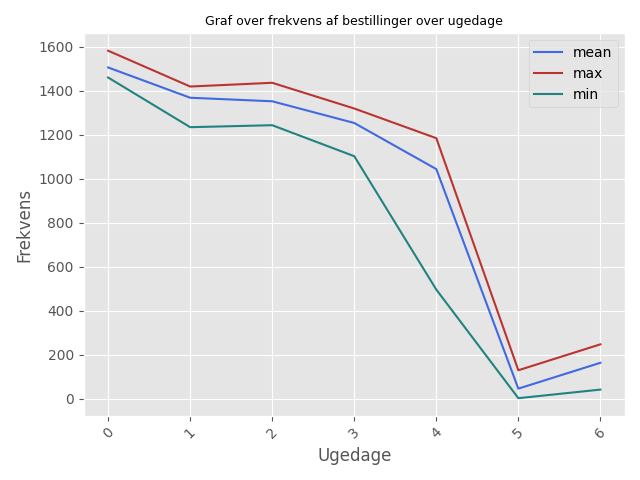
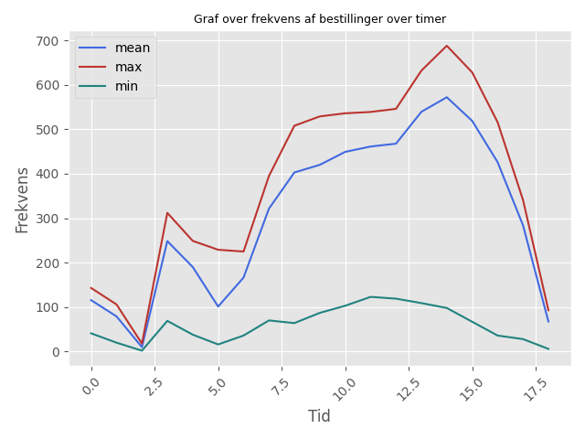
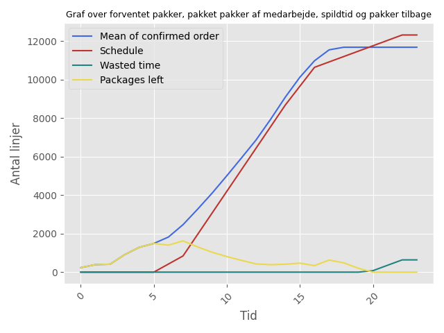

# 

## Problemstilling

Sammensæt en vagtplan for en virksomhed givet et datasæt over de sidste to måneder.

Virksomheden har en polik med, at alle bestilling før 18:00 skal afsted samme dag senest 23:00.

Information omkring virksomheden: 

## Analyse
### 2.1) Hvordan ser dataet ud?
| Kolonne               | Beskrivelse                                                |
| --------------------- | ---------------------------------------------------------- |
| Year                  | År                                                         |
| Month                 | Måned                                                      |
| Week                  | Ugenummer                                                  |
| Weekday               | Ugesdag (1 = mandag, ..., 7 = søndag)                      |
| Frigivelsesdato       | Dato for modtagelse af bestillingen. Format (DD-MM-YYYY)   |
| Lager                 | Hvilket lager varen findes i                               |
| Lagerområde           | Hvilket lagerområde varen findes i                         |
| KO/DO                 | Hvilken slags bestilling det er                            |
| Hour                  | Hvilket tidspunkt bestilling er modtaget                   |
| Afgangstid            | vornår bestillingen forlader lageret                       |
| Antal_linjer          | Hvor mange genstande der er i en given bestilling          |
| Teoretisk_bemandning  | Den teorietiske tid som medarbejderen bruger på bestilling |

### 2.2) Hvornår bliver en bestilling lavet?

Først plottes et histogram over, hvilke datoer bestillingerne bliver lavet på.

På figur 1 ses det, at der er et tydeligt ugentligt mønster.

Der bliver lavet flest bestillinger på hverdage, mens der kun er få bestillinger i weekenden.

Vi bemærker desuden, at datasættet indeholder data fra uge 52 og 53.

Da dette falder i juleferien, vælger vi at fjerne disse to uger fra datasættet, da de bidrager til at afspejle en normal ugeplan.

## 2.3) Størrelsen på en bestilling
Størrelsen på en bestilling er bestemt af variablen `Antal_linjer`.

Det ses herunder, hvilke forskellige værdier som variablen kan antage. 

Bemærk den markante forskel mellem gennemsnit og median, hvilket kan indikere en skæv fordeling af bestillingsstørrelser.

|               | Værdi   |
| ------------- | ------- |
| Mindst værdi  |       1 | 
| Største værdi |    2164 | 
| Gennemsnit    |   18.11 | 
| Variance      | 6103.17 |
| Median        |       2 |

## 2.4) Hvor hurtigt pakker en medarbejder en bestilling?
Hvor hurtigt en medarbejder kan pakke en bestilling afhænger af mange variabler.

I datasættet ses dog en lineær sammenhæng mellem
 `Antal_linjer` og `Teoretisk_bemandning`.

Dette viser, at en medarbejder teoretisk set kan pakke 35 genstande pr. time.

## 2.5) I hvilket lager og lageområde findes bestillingen i?
### Lager
Histogram over hvilke datoer bestillingerne bliver lavet på for hhv. `Lager 1` og `Lager 2`.

### Lagerområder

Histogram over hvilke lagerområder bestillingerne bliver lavet på for hhv. `Lager 1` og `Lager 2`.

## 2.6) Observeret fordeling på dagsbaseret
Der er flest bestillinger om mandagen. Herefter daler antallet frem til fredag, hvor der kun er meget få bestillinger i weekenden.

I figuren ses gennemsnittet for datasættet for den pågældende dag. Derudover vises også det respektive minimum og maksimum for antallet af bestillinger for den pågældende dag.

## 2.7) Observeret fordeling på timebaseret
Der er få bestillinger mellem 00:00 og 04:00, hvorefter der sker et hop. Mellem 06:00 og 15:00 stiger antallet af bestillinger, mens det efter 15:00 daler kraftigt. Efter 18:00 er der ingen bestillinger.

Tilsvarende som for overstående, så i figuren ses gennemsnittet for datasættet for den pågældende dag. Derudover vises også det respektive minimum og maksimum for antallet af bestillinger for den pågældende dag.

## 2.8) Timeplan
Vi tager udgangspunkt i gennemsnittet for antallet af bestillinger på en typisk hverdag for at gøre analysen nemmer. Som det fremgår af figur 1, er der særdeles få bestillinger i weekenden (næsten ingen). 
Lagre og lagerområder indgår ikke i analysen. 
Vi ser heller ikke på forskellige lager og/eller lagerområder.

Vi antager, at medarbejderne kan fordeles på følgende vagthold. 

| Vagthold     | Tidsrum       |
| ------------ | ------------- |
| Morgenholdet | 06:00 - 14:00 |
| Dagsholdet   | 08:00 - 16:00 |
| Aftensholdet | 15:00 - 23:00 |

Hertil vil en af løsningerne være følgende vagtplan:
| Vagthold     | Antal |
| ------------ | ----- |
| Morgenholdet |    12 |
| Dagsholdet   |    20 |
| Aftensholdet |     8 |

Figuren viser, at alle bestillinger for den pågældende dag bliver pakket, men at der opstår spildtid for medarbejderne til sidst af dagen.

Vi forudsætter, at medarbejderne kan organiseres i følgende vagthold:

###

## Andre vinkler
Hvad kunne ellers være undersøgt?

- **Tidsplan for lagre og lagerområder:**
  Bemærk, at `Lager 2` ikke har behov for en weekend-vagtplan. Vi kunne også havde set på, hvornår en bestilling bliver lavet for hhv. `Lager 1` og `Lager 2`.

- **Leveringstidspolitik:**
  Virksomheden har en politik om, at alle bestillinger, der er lavet før kl. 18:00 på den pågældende dag, skal afsendes samme dag. Derfor kunne man overveje, om der er behov for medarbejdere på arbejde mellem 18:00 og 23:00. Dette ville betyde, at bestillinger lavet i dette tidsrum først bliver pakket næste dag.

- **Vagtplaner baseret på ugedage:**
  Da der er flest bestillinger om mandagen og frem til fredag, kunne man oprette separate vagtplaner for hver ugedag.

- **Fleksible vagthold:**
  Man kunne overveje at indføre forskellige vagthold, f.eks. på 4 timer, eller at differentiere mellem forskellige typer medarbejdere, såsom deltidsansatte og vikarer.