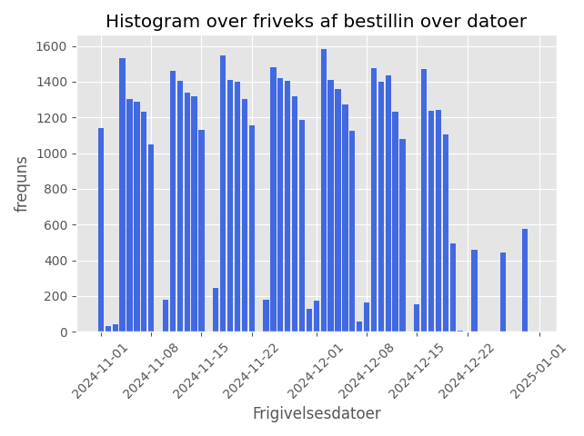
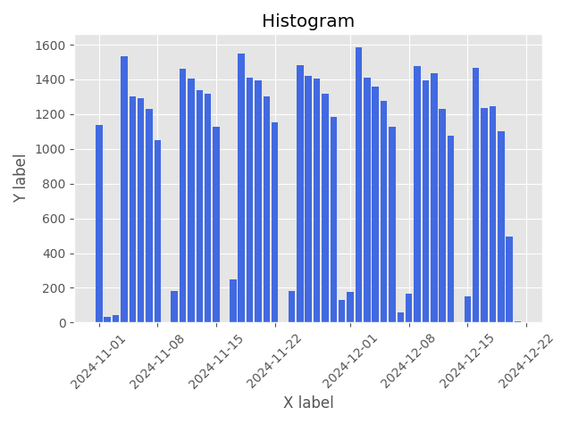
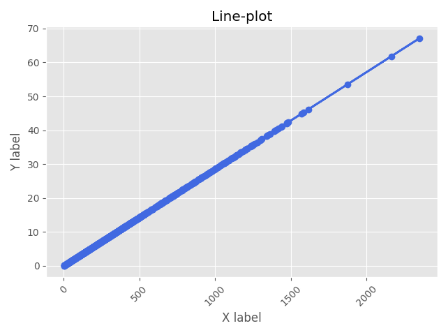
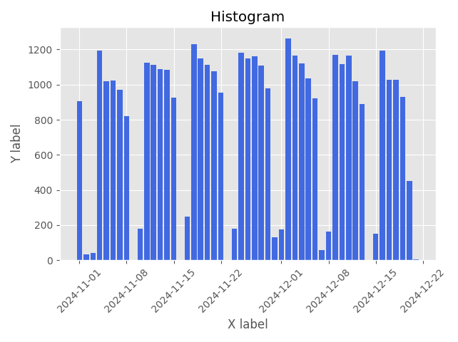
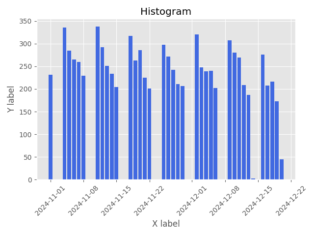
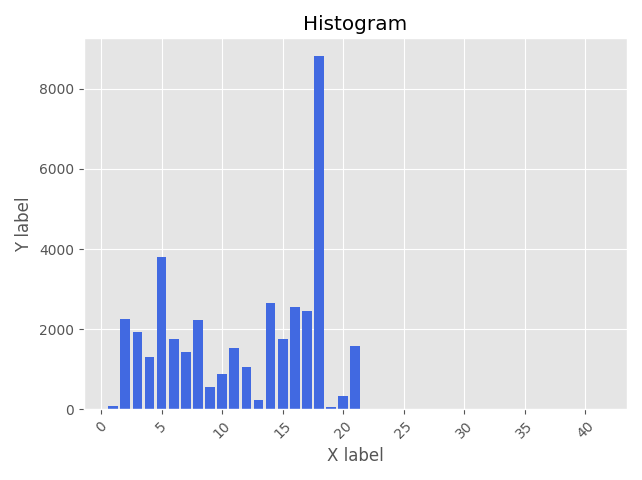
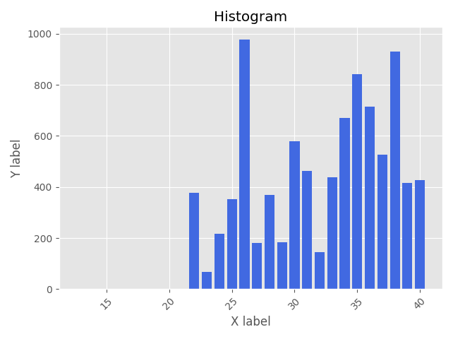

# 

# Problemstilling

# Analyse
## Hvordan ser dataet ud?
| Kolonne               | Beskrivelse                                                |
| --------------------- | ---------------------------------------------------------- |
| Year                  | År                                                         |
| Month                 | Måned                                                      |
| Week                  | Ugenummer                                                  |
| Weekday               | Ugesdag (1 = mandag, ..., 7 = søndag)                      |
| Frigivelsesdato       | Dato for modtagelse af bestillingen. Format (DD-MM-YYYY)   |
| Lager                 | Hvilket lager varen findes i                               |
| Lagerområde           | Hvilket lagerområde varen findes i                         |
| KO/DO                 | Hvilken slags bestilling det er                            |
| Hour                  | Hvilket tidspunkt bestilling er modtaget                   |
| Afgangstid            | vornår bestillingen forlader lageret                       |
| Antal_linjer          | Hvor mange genstande der er i en given bestilling          |
| Teoretisk_bemandning  | Den teorietiske tid som medarbejderen bruger på bestilling |

## Hvornår bliver en bestilling lavet?
Først plotter vi et histogram over hvilke datoer bestillingerne bliver lavet på.

Herunder på fig. 1 ses det tydeligt, at der fremgår et fast mønster for hver uge.

Der bliver lavet flest bestillinger i hverdagene, mens i weekenenden er der fåtalige. 

Vi bemærker også, at vi har data fra uge 52 og uge 53.
Vi vælger at fratage disse to uge fra datasættet, da det er ferie uger og dermed vil ikke kunne bidrage til en normal ugeplan.

## Størrelsen på en bestilling
Størrelsen på en bestilling er bestemt af variablen `Antal_linjer`.

| Test          | Værdi   |
| ------------- | ------- |
| Mindst værdi  |       1 | 
| Største værdi |    2164 | 
| Gennemsnit    |   18.11 | 
| Variance      | 6103.17 |
| Median        |       2 |

## Hvor hurtigt pakker en medarbejder en bestilling?
Det er en variablet variabel, da det det 

Vi ser dog i datasættet, at der er et lineært sammenhæng mellem `Antal_linjer` og `Teoretisk_bemandning`.

Dermed ses det, at en medarbejder teoretisk vil kunne pakke 35 genstande pr. time.

## I hvilket lager og lageområde findes bestillingen i?

Billede af histogram 1 for lager 1 og lager 2

### Lagerområder

For at holde analysen mindre kompleksi er der ikke blevet set på en time-baseret for hver ugedag.
Se konklusion for en uddybende diskontion omkring valget.

## Fordeling på dags-baseret og time-basseret
### dags-baseret

### time-basseret

For at holde analysen mindre kompleksi er der ikke blevet set på en time-baseret for hver ugedag.
Se konklusion for en uddybende diskontion omkring valget.

## Timeplan
Vi antager at medarbejderne kan fordeles på
| Vagthold     | Tidsrum       |
| ------------ | ------------- |
| Morgenholdet | 06:00 - 14:00 |
| Dagsholdet   | 08:00 - 16:00 |
| Aftensholdet | 15:00 - 23:00 |

I denne analyse antager vi, at medarbejder ikke kan deles mellem lagerne, men derimod godt imellem lagerområder. 
Vi antager ydligere, at medarbejderne tidlist vil møde ind kl. 06:00 og senest tage fri kl 23:00. Derudover, så må der ikke være en vagt på over 8 timer og mindre end 3 timer.
Som nævnt i problemstillingen, så har virksomheden en frist kl 18:00 med at alle bestillingen før det, skal være pakket og sent afsted senest kl. 23:00.

###

## Konklusion

Hvad kunne ellers har været set på?
- En tidsplan for hvert lager og/eller lagerområde. 
- Da virksomheden har en polik med at alle bestillingen lavet før 18:00 den opgældende dag skal afsted samme dag, så kan man overveje hvorvidt man skal have medarbejde på arbejde mellem 18:00 og 23:00. Det vil sige, at alle bestillinger lavet mellem 18:00 og 23:00 først bliver pakket næste dag.
- Har en vagtplan for hver hverdag, idet der er flest bestillingerne mandag og frest fredag.
